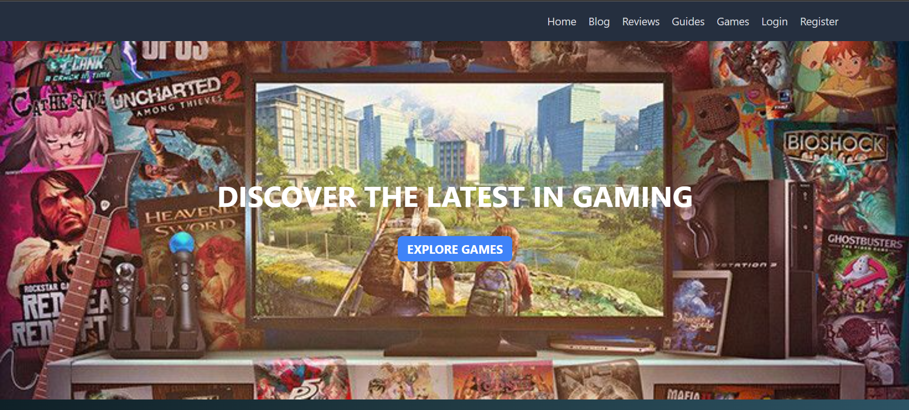
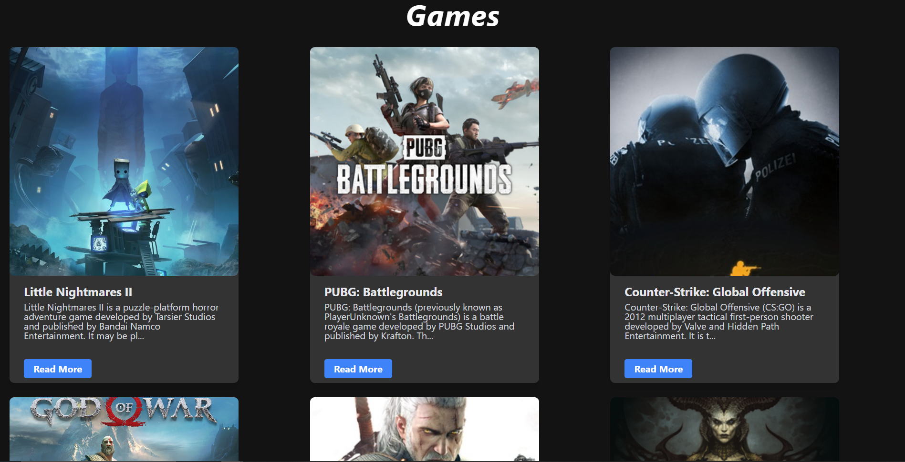
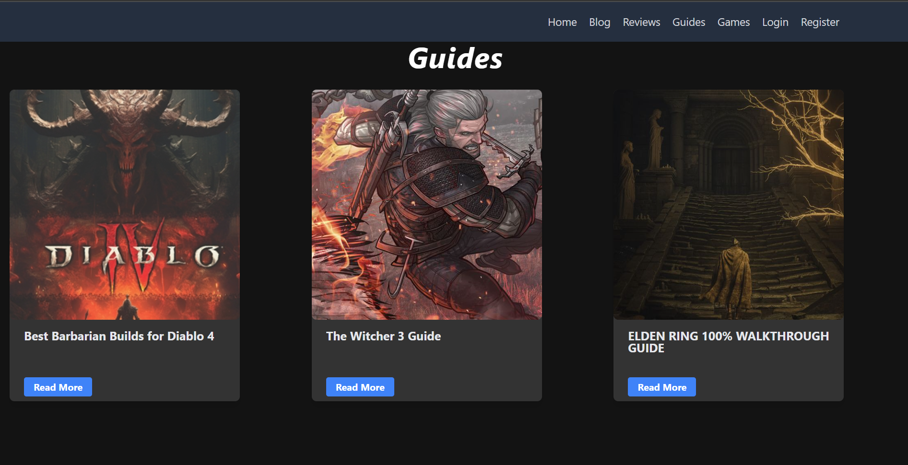
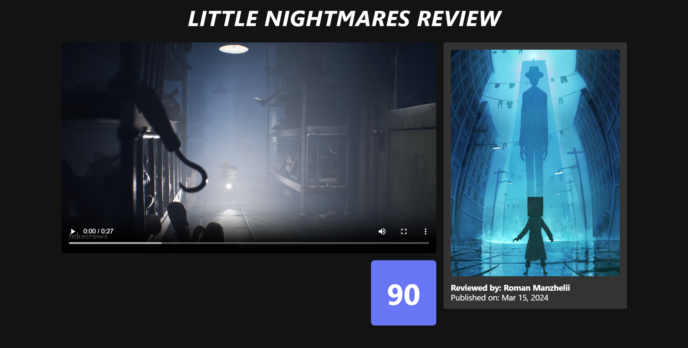

# Game-Blog

**Game-Blog** is a complete blog application built using Laravel 8, tailored for gaming enthusiasts. The application includes user authentication, CRUD operations for posts and games, commenting features, dynamic routing, and a responsive design.

## Requirements

- PHP 7.3 or higher
- Node 12.13.0 or higher

## Installation and Setup Instructions

### Setting up your development environment on your local machine:

1. **Clone the repository:**
   ```bash
   git clone https://github.com/Roman-Manzhelii/Game-Blog.git
   cd Game-Blog
   ```

2. **Copy the example environment file and install dependencies:**
   ```bash
   cp .env.example .env
   composer install
   ```

3. **Generate the application key and clear caches:**
   ```bash
   php artisan key:generate
   php artisan cache:clear && php artisan config:clear
   ```

4. **Serve the application:**
   ```bash
   php artisan serve
   ```

### Before starting

1. **Create a database:**
   ```bash
   mysql
   create database laravelblog;
   exit;
   ```

2. **Set up your database credentials in the `.env` file:**
   ```env
   DB_CONNECTION=mysql
   DB_HOST=127.0.0.1
   DB_PORT=3306
   DB_DATABASE=laravelblog
   DB_USERNAME={USERNAME}
   DB_PASSWORD={PASSWORD}
   ```

3. **Migrate the tables:**
   ```bash
   php artisan migrate
   ```


## Screenshots


*Home page*


*Page Games*


*Page Guides*


*One of many reviews*

## Data Structure

| Table    | Description                              |
|----------|------------------------------------------|
| Users    | Holds user information                   |
| Posts    | Stores all blog posts                    |
| Guides   | Stores all guides (based on games table) |
| Reviews  | Stores all reviews                       |
| Games    | Stores all games                         |
| Comments | Contains user comments for reviews       |

## Features

- User authentication system.
- CRUD operations for posts and games.
- Commenting feature on reviews.
- Dynamic routing for cleaner URLs.
- Responsive design for multiple devices.

## Technologies Used

- PHP Laravel 8
- MySQL for database management
- Bootstrap, Tailwind, and CSS for styling
- TinyMCE for rich text editing

## Author

[Roman Manzhelii](https://github.com/Roman-Manzhelii)

## Contact

For more information or questions, please contact: romamanzheliy1@gmail.com
